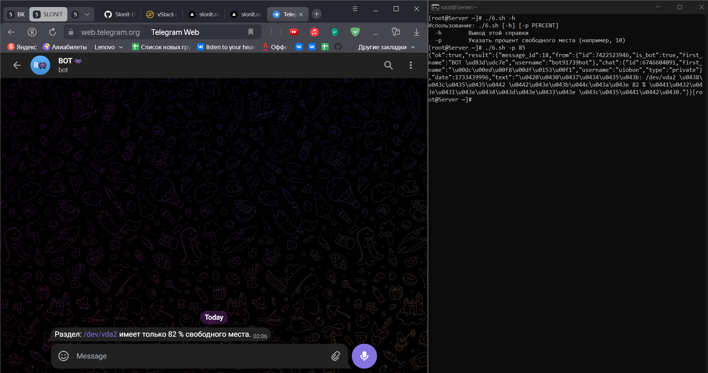
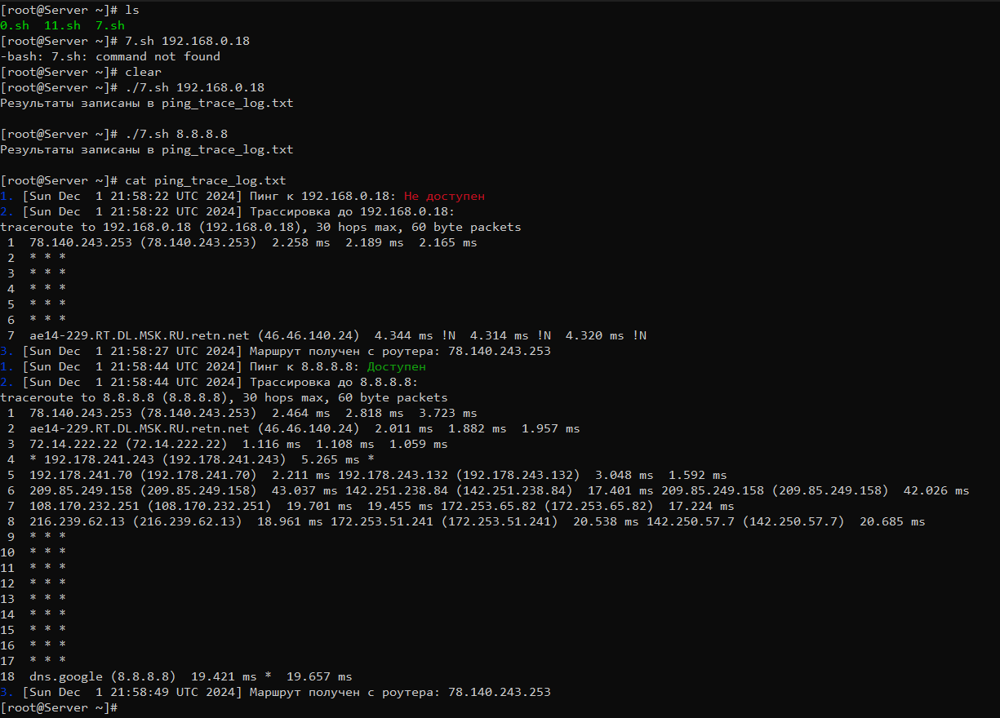
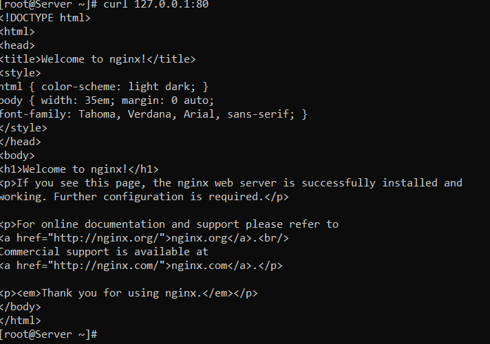
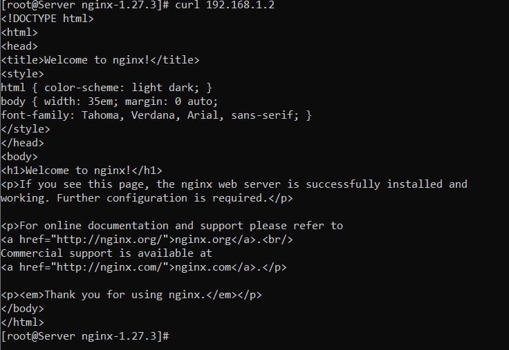
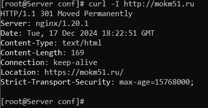
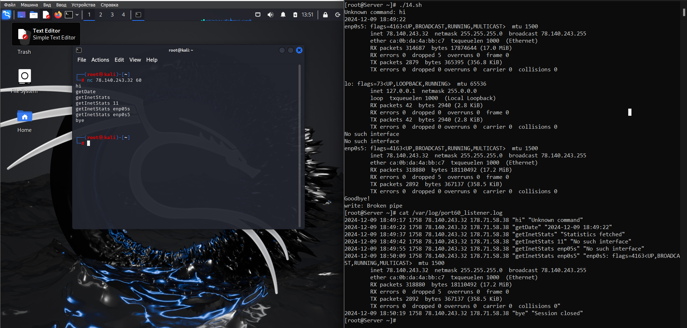
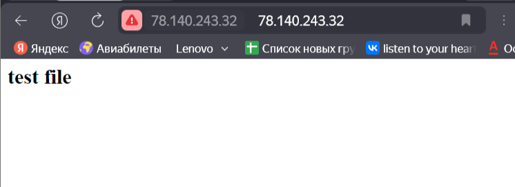
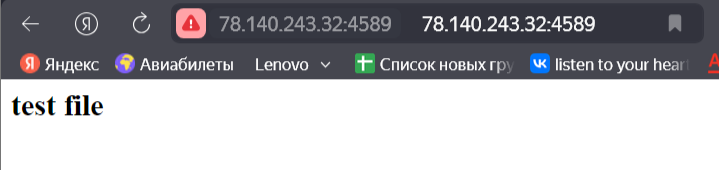
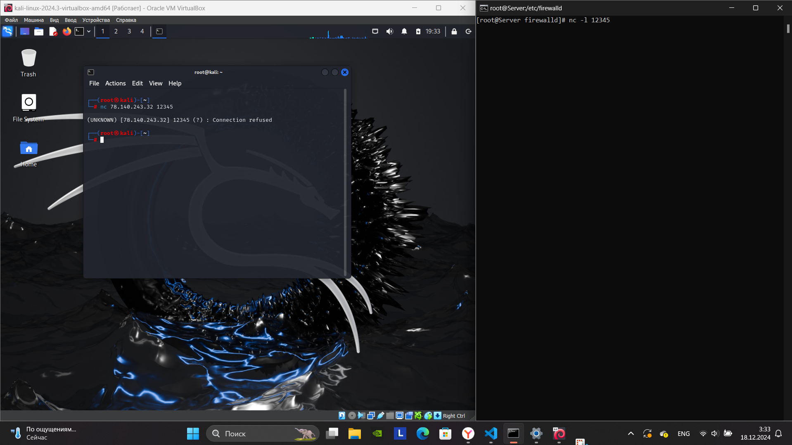
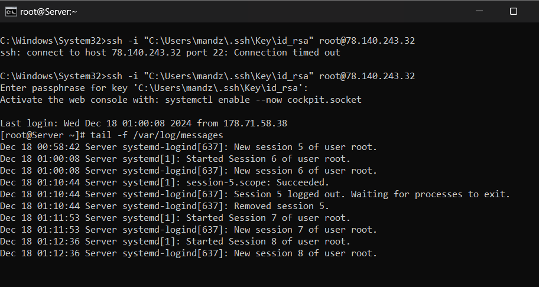

# Домашнее задание №3

---

## Общая команда
```bash
[root@Server ~]# ./0.sh <имя_файла>
```

---

## Задание 1
```bash
[root@Server ~]# ./1.sh
Введите имя пользователя: lp
Шелл пользователя: /sbin/nologin
Домашняя директория: /var/spool/lpd
Список групп: lp
Что вы хотите изменить? (uid/home/group): uid
Введите новый uid: 0
UID 0 уже занят
Введите новый uid: 25
Команда для смены UID: usermod -u 25 lp
```

---

## Задание 2
```bash
[root@Server ~]# ./2.sh
Введите название файла: hello.txt
Введите права доступа для файла (в формате 777): 555
Права доступа 555 установлены для файла hello.txt
[root@Server ~]# ls
0.sh  1.sh  2.sh  archive.tar.gz  hello.txt  output.txt
[root@Server ~]# ls -l hello.txt
-r-xr-xr-x. 1 root root 0 Nov 29 20:09 hello.txt
```

---

## Задание 3
```bash
[root@Server ~]# ./3.sh
Введите путь до блочного устройства: /dev/vda2
Устройство /dev/vda2 уже примонтировано.
```

---

## Задание 4
```bash
[root@Server ~]# ./4.sh
1. root
2. bin
3. daemon
4. adm
5. lp
6. sync
7. shutdown
8. halt
9. mail
10. operator
11. games
12. ftp
13. nobody
14. dbus
15. systemd-coredump
16. systemd-resolve
17. tss
18. polkitd
19. clevis
20. unbound
21. libstoragemgmt
22. setroubleshoot
23. cockpit-ws
24. cockpit-wsinstance
25. sssd
26. chrony
27. sshd
28. tcpdump
```

---

## Задание 5
```bash
[root@Server ~]# ./gen.sh "Использование: $0 <использование> <кол-во файлов> <маска имени файла>" 3 5
:))
[root@Server ~]# rm -f gen.sh.lock
[root@Server ~]# ./gen.sh "Использование: $0 <использование> <кол-во файлов> <маска имени файла>" 3 5
0.sh
5_1
5_2
5_3
5.sh
gen.sh
gen.sh.lock
Скрипт завершен за: 1733422664
[root@Server ~]# cat /tmp/file_list_160482.txt
0.sh
5_1
5_2
5_3
5.sh
gen.sh
gen.sh.lock
[root@Server ~]# tar -tf /tmp/archive_160482.tar
5_1
5_2
5_3
```

---

## Задание 6


### Добавление в cron:
1. `sudo nano /etc/crontab`
2. `*/8 * * * * root /root/6.sh -p 85`

---

## Задание 7


---

## Задание 8
```bash
wget http://nginx.org/download/nginx-1.27.3.tar.gz
tar -zxvf nginx-1.27.3.tar.gz

cd nginx-1.27.3

git clone https://github.com/ritchie-wang/nginx-upstream-dynamic-servers.git

./configure --add-module=./nginx-upstream-dynamic-servers
make
sudo make install

sudo /usr/local/nginx/sbin/nginx

sudo /usr/local/nginx/sbin/nginx -s reload
```



```bash
ip netns add nginx_ns

ip link add veth0 type veth peer name veth1

ip link set veth1 netns nginx_ns

ip addr add 192.168.1.1/24 dev veth0
ip link set veth0 up

ip netns exec nginx_ns ip addr add 192.168.1.2/24 dev veth1
ip netns exec nginx_ns ip link set veth1 up
ip netns exec nginx_ns ip link set lo up

ip netns exec nginx_ns ip route add default via 192.168.1.1

ip netns exec nginx_ns /usr/local/nginx/sbin/nginx

curl 192.168.1.2
```



```bash
cd /usr/local/nginx/conf

nano reverse_proxy.conf
```

```nginx
worker_processes  1;

events {
    worker_connections  1024;
}

http {
    include       mime.types;
    default_type  application/octet-stream;

    sendfile        on;
    keepalive_timeout  65;

    server {
        listen 80;
        server_name mokm51.ru www.mokm51.ru;

        location / {
            proxy_pass https://mokm51.ru;
            proxy_set_header Host $host;
            proxy_set_header X-Real-IP $remote_addr;
            proxy_set_header X-Forwarded-For $proxy_add_x_forwarded_for;
            proxy_set_header X-Forwarded-Proto $scheme;

            proxy_connect_timeout 30;
            proxy_read_timeout 30;
            proxy_send_timeout 30;

            proxy_buffering on;
            proxy_buffers 16 64k;
            proxy_buffer_size 128k;
        }

        error_page 404 /404.html;
        location = /404.html {
            root   html;
        }
    }
}
```
```bash
/usr/local/nginx/sbin/nginx -t

/usr/local/nginx/sbin/nginx -s reload

curl -I http://mokm51.ru
```


---

## Задание 9
```bash
[root@Server ~]# ./9.sh /root "1 hour ago" | grep -E '[0-9]'
/root/1.sh
/root/0.sh
/root/2.sh
/root/3.sh
/root/4.sh
```

---

## Задание 10
```bash
[root@Server ~]# ./10.sh -a
1: john 1700000000 1733193898 /home/john
2: alice 1700050000 1700100000 /home/alice123
3: bob 1699950000 - /home/bob
4: eric 1733107727 - /home/eric
5: rose 1733193869 - /home/rose
[root@Server ~]# ./10.sh -s eric
eric 1733107727 - /home/eric
[root@Server ~]# ./10.sh -d eric
Пользователь eric удален.
[root@Server ~]# ./10.sh -c Dwayne Johnson -h /home/dwayne
[root@Server ~]# ./10.sh -a
1: john 1700000000 1733193898 /home/john
2: alice 1700050000 1700100000 /home/alice123
3: bob 1699950000 - /home/bob
4: eric 1733107727 1733194281 /home/eric
5: rose 1733193869 - /home/rose
[root@Server ~]# ./10.sh -c DwayneJohnson -h /home/dwaynejohnson
Пользователь DwayneJohnson добавлен.
[root@Server ~]# ./10.sh -a
1: john 1700000000 1733193898 /home/john
2: alice 1700050000 1700100000 /home/alice123
3: bob 1699950000 - /home/bob
4: eric 1733107727 1733194281 /home/eric
5: rose 1733193869 - /home/rose
6: DwayneJohnson 1733194589 - /home/dwaynejohnsonб
```

---

## Задание 11
```bash
[root@Server ~]# ./11.sh 649
^C
[root@Server ~]# ./11.sh kthreadd
^C
[root@Server ~]# ./11.sh 87827827
^C
[root@Server ~]# cat checker.log
01-12-2024 19-25-18 mySvcChecker: service 649 isUP
01-12-2024 19-25-21 mySvcChecker: service 649 isUP
01-12-2024 19-25-24 mySvcChecker: service 649 isUP
01-12-2024 19-25-35 mySvcChecker: service kthreadd isUP
01-12-2024 19-25-38 mySvcChecker: service kthreadd isUP
01-12-2024 19-25-41 mySvcChecker: service kthreadd isUP
01-12-2024 19-26-04 mySvcChecker: service 87827827 isDown
01-12-2024 19-26-07 mySvcChecker: service 87827827 isDown
```

---

## Задание 12
```bash
[root@Server ~]# ls
0.sh  12.sh  1.txt  2.txt
[root@Server ~]# ./12.sh 1.txt 2.txt
Оба файла существуют
[root@Server ~]# ./12.sh 3.txt 2.txt
Входной файл не существует
[root@Server ~]# ./12.sh 1.txt 3.txt
Hi
Hello
1
2
3
4
5
6
7
8
9
10
Goodbye
Bye
[root@Server ~]# cat 1.txt
Hello
Hi
2
1
4
3
6
5
8
7
10
9
Bye
Goodbye
```

---

## Задание 13
### Часть 1
В качестве сервера приёмника я буду использовать Oracle Linux 8.6 x64

```bash
[root@Server ~]# nc -l -p 12345 -k
Hello from Kali
#TCP
```

```bash
[root@Server ~]# nc -u -l -p 12345
Hello from Kali x2
#UPD
```
В качестве сервера отправителя буду использовать Kali Linux

```bash
┌──(root㉿kali)-[~]
└─# echo "Hello from Kali" | nc 78.140.243.32 12345 
#TCP
```

```bash
┌──(root㉿kali)-[~]
└─# echo "Hello from Kali x2" | nc -u 78.140.243.32 12345
#UDP
```

### Часть 2


### Часть 3
```bash
[root@Server ~]# sudo ip link set enp0s5 down

[root@Server ~]# sudo ip link set dev enp0s5 address 02:01:02:03:04:08

[root@Server ~]# sudo ip link set enp0s5 up

[root@Server ~]# ip link show enp0s5
2: enp0s5: <BROADCAST,MULTICAST,UP,LOWER_UP> mtu 1500 qdisc fq_codel state UP mode DEFAULT group default qlen 1000
    link/ether 02:01:02:03:04:08 brd ff:ff:ff:ff:ff:ff
```

```bash
[root@Server ~]# tcpdump -i enp0s5
```
---

## Задание 14
```bash
[root@Server ~]# getenforce
Permissive
```


---

## Задание 15
```bash
sudo setenforce 1

echo "<html><body><h2>test file</h2></body></html>" | sudo tee /pubHtml/index.html

nano /usr/local/nginx/conf/nginx.conf
```

```nginx
server {
    listen       80;
    server_name  localhost;

    location / {
        root   /pubHtml;
        index  index.html;
    }
}
```

```bash
/usr/local/nginx/sbin/nginx -t

sudo /usr/local/nginx/sbin/nginx -s reload

sudo ausearch -m avc -ts recent

sudo ausearch -m avc -ts recent | audit2allow -M nginx_pubhtml

sudo semodule -i nginx_pubhtml.pp

sudo /usr/local/nginx/sbin/nginx -s reload

curl localhost

nano /usr/local/nginx/conf/nginx.conf
```
```nginx
server {
    listen       4589;
    server_name  localhost;

    location / {
        root   /pubHtml;
        index  index.html;
    }
}
```
```bash
sudo /usr/local/nginx/sbin/nginx -s reload

sudo ausearch -m avc -ts recent

sudo audit2allow -M nginx_pubhtml_port4589
```



---

## Задание 16

### firewalld
```bash
systemctl start firewalld

nano /etc/firewalld/services/serv.xml

firewall-cmd --reload

firewall-cmd --permanent --zone=public --add-service=serv
```

```xml
<?xml version="1.0" encoding="utf-8"?>
<service>
  <short>My Custom Service</short>
  <description>Custom service on port 12345</description>
  <port protocol="tcp" port="12345"/>
</service>
```

```bash
nano /etc/firewalld/zones/public.xml
```

```xml
<!-- Добавляем блок -->
<rule family="ipv4">
    <source address="178.71.58.38"/>
    <reject/>
</rule>
```



### iptables
```bash
dnf install iptables-services

iptables -A INPUT -p tcp --dport 22 -s 178.71.58.38 -j ACCEPT
iptables -A INPUT -p tcp --dport 22 -s 192.168.0.18 -j ACCEPT
iptables -A INPUT -p tcp --dport 22 -j REJECT

service iptables save
systemctl restart iptables

# Логирование для отклонения соединений
iptables -A INPUT -p tcp --dport 22 -j LOG --log-prefix "SSH REJECT: "

tail -f /var/log/messages
```

